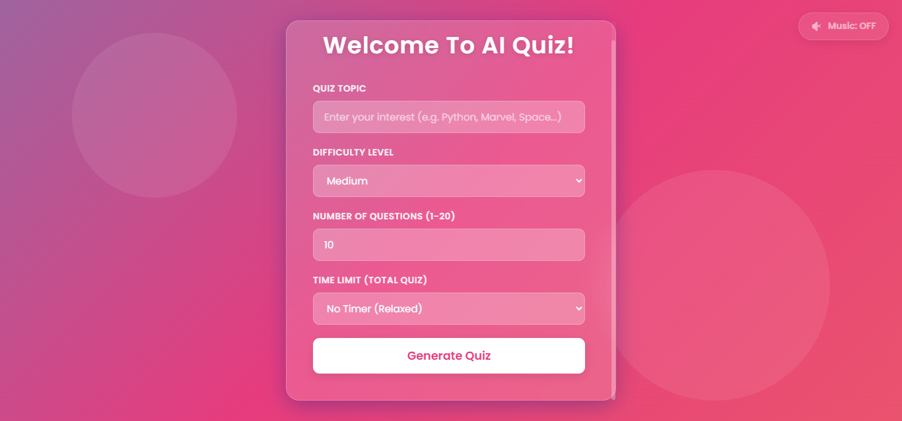
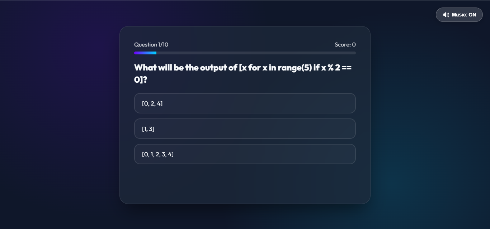

# 🧠 AI Quiz Generator (Flask & Gemini AI)

An interactive, premium, topic-based quiz generator web application. Built with **Flask** and powered by **Google Gemini 2.5 Flash**, it generates customizable technical or general knowledge tests dynamically. The user interface features a modern **Glassmorphism** layout styled using custom CSS, complete with ambient looping background music, interactive countdown timers, and congratulatory confetti effects.

---

## 📸 Screenshots

### 🏠 Homepage - Customize & Generate
Here, you can choose any topic, difficulty, number of questions, and timer limit before starting:


### ⏱️ Quiz Screen - Interactive & Timed
Answer multiple-choice questions, monitor your progress bar, and keep track of the remaining time:


---

## ✨ Features

- **💡 Dynamic Quiz Generation**: Simply enter any topic (e.g. Python, Marvel, Astronomy, History) and Gemini AI will formulate unique multiple-choice questions.
- **⚡ Structured Pydantic Output**: Integrated with the latest `google-genai` SDK and Pydantic models to guarantee valid JSON formatting and eliminate parsing crashes.
- **⚙️ Difficulty Levels**: Tailor tests with Easy, Medium, or Hard difficulty categories.
- **📊 Question Customization**: Choose exactly how many questions you want (from 1 to 20).
- **⏱️ Countdown Timer**: Add a total quiz time limit (1, 2, 5, 10, 20 minutes) or play relaxed with no timer. Warning triggers pulse the display red when 15 seconds remain.
- **🔊 Ambient Background Music**: Features a loopable background track with a floating toggle control (ON/OFF) that synchronizes seamlessly across page refreshes and transitions.
- **🎉 Confetti Celebrations**: Reaching a perfect score of 100% unleashes a beautiful confetti shower across your screen.
- **🎨 Glassmorphic Styling**: Styled from scratch using modular CSS files ([index.css](static/index.css) & [quiz.css](static/quiz.css)) for maximum customizability.

---

## 🛠️ Tech Stack

* **Backend**: Flask (Python)
* **AI Model**: Google Gemini 2.5 Flash (`google-genai` SDK)
* **Frontend**: HTML5, Vanilla JavaScript, CSS3
* **Libraries**: `canvas-confetti` (interactive animations)
* **Data Schema**: Pydantic (`BaseModel`)

---

## 🚀 Setup & Installation

### 1. Clone the Project
Navigate to your preferred directory and ensure the following folder structure is intact:
```
AI Quize/
├── app.py
├── .env
├── static/
│   ├── index.css
│   ├── quiz.css
│   ├── bg-music.mp3
│   └── images/
│       ├── index.PNG
│       └── questions.PNG
└── templates/
    ├── index.html
    └── quiz.html
```

### 2. Install Dependencies
Make sure you have python installed, and install the required modules:
```bash
pip install flask google-genai pydantic python-dotenv
```

### 3. Configure API Key
Create or edit the `.env` file in the root directory and add your Google Gemini API key:
```env
GEMINI_KEY="your-gemini-api-key-here"
```

### 4. Run the Application
Start the Flask dev server:
```bash
python app.py
```
Open your browser and navigate to `http://127.0.0.1:5000` to start playing!

---

## 📝 License
This project is open-source and free to customize. Happy coding!
